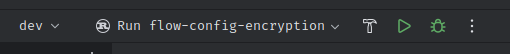

This document showcases all the steps necessary to set up an environment to develop an Estuary
connector as of 11/2024.

> [!WARNING]
> It is assumed that the reader can use and understand the terminal, and that they can
> install any piece of software by just being given the name or the documentation link.
> Not always specific commands will be given, as they might differ depending on the reader's system.

> [!NOTE]
> There might be additional system packages that you need to install, steps documented here are
> general,
> you might need to resolve your system-specific issues.


Estuary uses [Tilt](https://github.com/tilt-dev/tilt), Tilt is a microservice development
environment for teams that deploy to Kubernetes.

Any other way of setting up the environment is not supported by Estuary or the CrateDB devex team.

### Step 1: Install tilt.

Go to the [GitHub](https://github.com/tilt-dev/tilt) and follow its installation process.

Check that tilt is properly installed.

```
┗❯ tilt

Tilt helps you develop your microservices locally.
Run 'tilt up' to start working on your services in a complete dev environment
configured for your team.

Tilt watches your files for edits, automatically builds your container images,
and applies any changes to bring your environment
up-to-date in real-time. Think 'docker build && kubectl apply' or 'docker-compose up'.

Usage:
  tilt [command]
...
```

### Step 2: Prepare the directories and clone the repos.

Create a `estuary` directory, and clone the following repos inside:

1. [flow](https://github.com/estuary/flow)
2. [connectors](https://github.com/estuary/connectors)
3. [ui](https://github.com/estuary/ui)
4. [config-encryption](https://github.com/estuary/config-encryption)

It should look like this:

```
estuary/
  ├── config-encryption/
  ├── connectors/
  ├── flow/
  └── ui/
```

### Step 3: Install `ui`

> [!NOTE]
> You are expected to have npm and node installed in your system.

The ui repo, needs a GitHub PAT token with `read:packages` permission.

1. Create a GitHub PAT Token, [instructions](https://docs.github.com/en/authentication/keeping-your-account-and-data-secure/managing-your-personal-access-tokens#creating-a-personal-access-token-classic)
2. Then update your `~/.npmrc` with:

```
//npm.pkg.github.com/:_authToken=__YOUR_AUTH_TOKEN_YOU_MADE_ON_GITHUB__
@estuary:registry=https://npm.pkg.github.com/
```

3. Inside the `ui` directory, run:

```sh
 npm install
```

### Step 4: Install the supabase cli

Depending on your system, it might be different [docs](https://supabase.com/docs/guides/local-development/cli/getting-started)

Check that supabase is correctly installed

```
┗❯ supabase
Supabase CLI

Usage:
  supabase [command]

Quick Start:
  bootstrap            Bootstrap a Supabase project from a starter template

Local Development:
  db                   Manage Postgres databases
...
```

### Step 4: Install Rust

Rust [installation doc](https://doc.rust-lang.org/book/ch01-01-installation.html)

You might need to add extra targets, for example, as I develop in Arch-linux I had to

`rustup target add x86_64-unknown-linux-musl`, rust will tell you later in the last step 
when the compilation takes place.

### Step 5: Install musl (musl-gcc)

Installation varies on system.

### Step 6: Compile `config-encryption`

If you have RustRover, you can open the project `estuary/config-encryption` that you cloned on step 2,
it will automatically pick up the workflow 

clicking on the hammer will build (compile) the application.

Alternatively, inside `config-encryption` directory, run 

```shell
cargo build --package config-encryption --bin flow-config-encryption
```

### Step 7: Run tilt.

Inside `estuary/flow`, run:

```shell
tilt up
```

You will now have access to the Tilt ui, the local link is in the terminal output,
it will take a while to compile, depending on your CPU. 

You might get compile errors such as missing libraries, address those errors according
to your system, even though rust errors are usually very clear, don't hesitate to ask.

To Consider this step as successful, every service has to be up and running, showing a green box.